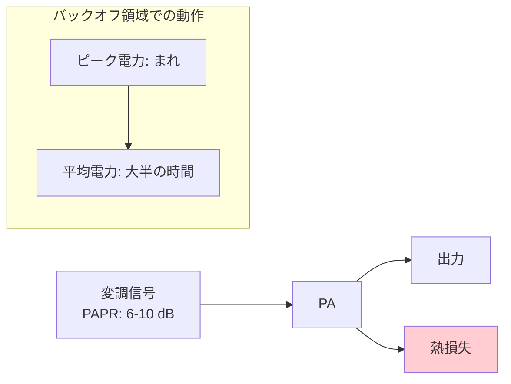
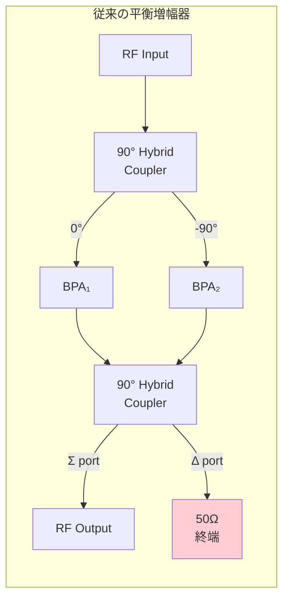

## はじめに

携帯基地局のRF電力増幅器（PA）において、効率とバックオフ性能の両立は長年の課題である。Doherty増幅器がこの分野を20年以上支配してきたが、2016年に登場した**負荷変調平衡増幅器（LMBA: Load-Modulated Balanced Amplifier）** は、Dohertyの根本的な帯域幅制約を解消する「潜在的に破壊的な技術」として注目を集めている。

本記事では、LMBAの基礎を以下の流れで解説する。

- **バックオフ効率の問題**と、なぜ負荷変調が必要なのか
- **LMBAの動作原理**：直交カプラ＋制御信号注入による能動的インピーダンス変調
- **通信基地局向け設計手法**と実測性能、Dohertyとの体系的比較

## 技術的背景：なぜバックオフ効率が重要なのか

現代の無線通信では、OFDMに代表される高PAPR（Peak-to-Average Power Ratio: ピーク対平均電力比）の変調方式が主流である。LTE/5Gの信号は典型的に6〜10 dBのPAPRを持つ。

PAの設計上のジレンマはこうである。ピーク電力に対応できるデバイスを選定すると、信号の**平均電力では6〜10 dB低い出力で動作する**ことになる。これを**出力バックオフ（OBO: Output Back-Off）** と呼ぶ。

通常のClass-AB増幅器では、バックオフ時の効率は急激に低下する。理想的なClass-B動作でも、6 dB OBOでは効率がピーク値の半分になる。基地局は消費電力の大部分をPAが占めるため、バックオフ効率の改善は通信システム全体の省エネルギーに直結する。

**負荷変調（Load Modulation）** は、この問題に対する根本的な解法である。信号振幅に応じてPAが見る負荷インピーダンスを動的に変化させ、バックオフ時にも高い効率を維持する。Dohertyもこの原理に基づくが、LMBAは全く異なるアプローチで負荷変調を実現する。

## 従来手法：Dohertyの成功と限界

Doherty増幅器は1936年の発明以来、基地局PAの事実上の標準である。主増幅器（Main）と補助増幅器（Auxiliary）を**共通ノード**で電流加算し、λ/4インピーダンスインバータを介して負荷変調を実現する。

Dohertyの実績は圧倒的だが、以下の本質的な制約がある。

1. **帯域幅制約**: λ/4インピーダンスインバータは特定周波数で設計されるため、本質的に狭帯域である
2. **オフセットライン**: 補助段がOFFのとき、共通ノードから見た開回路条件を実現するためにオフセットラインが必要であり、これが帯域をさらに制限する
3. **インピーダンス変調の方向性**: 実軸上の変調に限定され、反応性（リアクタンス）方向の制御が困難である

5GのSub-6 GHzでは1.7〜3.8 GHz（比帯域80%超）をカバーする広帯域PAが求められるが、従来Dohertyの比帯域はせいぜい30〜40%程度にとどまる。

## LMBAの動作原理

### 基本構成

LMBAの出発点は、RF回路設計者にとって馴染み深い**直交平衡増幅器（Balanced PA）** である。

従来の平衡増幅器では、出力カプラのアイソレートポート（Δポート）は50 Ωで終端される。ここに吸収される電力は熱として捨てられる。

**LMBAの核心的アイデア**は、この終端を取り除き、代わりに**制御信号（CSP: Control Signal Power）** を注入することである。

*Fig. 1: LMBAの基本ブロック図。出力カプラのアイソレートポートにCSP PAから制御信号を注入する。*

### インピーダンス変調の数式

CSPを注入したとき、各平衡増幅器（BPA）が見る駆動点インピーダンスは以下で表される [1]。

$$
Z_1 = Z_2 = Z_0\left(1 + \sqrt{2}\frac{I_C}{I_B}\right)
$$

ここで $Z_0$ はカプラの特性インピーダンス、$I_B$ はBPAの出力電流、$I_C$ はCSPの出力電流（複素数で振幅と位相の情報を含む）である。なお、論文によってポート番号や電流方向の規約が異なるため符号が変わることがある。例えばShepphard [2]では$-$符号で表記されているが、物理的な意味は同じである。

この式から、LMBAの重要な特性が読み取れる。

1. **振幅制御**: $|I_C|/I_B$ の比を変えることでインピーダンスの**大きさ**を変調できる
2. **位相制御**: $I_C$ の位相を変えることでインピーダンスの**方向**（Smith chart上の角度）を制御できる
3. **全方向変調**: Dohertyが実軸上に限定されるのに対し、LMBAはSmith chart上の任意の方向にインピーダンスを動かせる

CSP注入電力と平衡増幅器電力の比 $\alpha = P_{CSP}/P_{BPA}$ を定義すると、BPA側の反射係数の大きさは以下で決まる [2]。

$$
|\Gamma|^2 = \frac{\alpha}{\alpha + 2}
$$

$\alpha$ が一定の条件はSmith chart上で**原点を中心とする円**を描く。つまり、CSPの位相を360°回転させると、一定の電力比のままインピーダンスを円形に掃引できる。

*Fig. 2: CSP注入によるSmith chart上のインピーダンス変調。α一定の条件は原点中心の同心円となる。50 Ωから25 Ωへの2:1変調に必要なCSP電力は、単一BPAの-6 dB（α=0.25）、平衡ペア総出力の-9 dBに過ぎない [1][2]。*

### 電力保存則：CSP電力は無駄にならない

LMBAの見落とされがちだが重要な性質は、**CSP電力が常に出力で回収される**ことである [2]。

$$
P_{OUT} = 2P_{BPA} + P_{CSP}
$$

CSPの位相に関わらず、CSP電力は常に総出力電力に正に寄与する。これはDohertyでは補助段電力が主段と同相の場合にのみ完全回収されるのとは対照的である。

## LMBAの設計：通信基地局向け実装

### プリマッチングによるバックオフ最適化

基本LMBAでは、CSP=0のときBPAは $Z_0$（通常50 Ω）を見る。しかし通信用途ではバックオフ時の効率が最重要であり、CSPなしの状態でバックオフ最適負荷を提示したい。

Quagliaらは**プリマッチングネットワーク**の導入でこれを解決した [3]。無損失プリマッチングを経由しても反射係数の絶対値は保存される（$|\Gamma_{pre}| = |\Gamma|$）ため、負荷変調の量は劣化しない。位相差のみが生じるが、これはCSP入力位相で補正できる。

この設計により、CSPのON/OFF駆動法則は以下のようになる [3]。

$$
c = \begin{cases} 0, & 0 < b < \beta \\ \frac{1}{\sqrt{2}}(\beta - b), & \beta \leq b \leq 1 \end{cases}
$$

ここで $b$ と $c$ はそれぞれBPAとCSPの正規化電流振幅、$\beta$ はバックオフのブレークポイントである。CSPはバックオフ領域ではOFFのまま、ブレークポイントを超えるとピーク電力に向けて徐々にONになる。

### Dohertyとの本質的な違い

ここでDohertyと対比して、LMBAの設計上の利点を5項目で整理する [3]。

| 項目 | Doherty | LMBA |
|------|---------|------|
| 合成方式 | 共通ノードでの電流加算 | ハイブリッドカプラによるCSP電力合成 |
| 帯域幅の決定要因 | λ/4インバータの帯域 | 直交カプラの帯域（本質的に広帯域） |
| 補助段OFF時の要件 | オフセットライン（帯域制限要因） | **制約なし**（CSP位相は出力に影響しない） |
| 補助段電力の回収 | 主段と同相時のみ完全回収 | **位相に関わらず常に回収** |
| インピーダンス変調方向 | 実軸（抵抗性）のみ | Smith chart全方向（抵抗性＋反応性） |

ただし、**瞬時帯域幅**についてはDohertyが有利な場合がある。LMBAのCSP駆動には正確な位相制御が必要であり、広帯域変調信号への瞬時追従はDPDの複雑度を高める可能性がある [3]。

### 設計手順の概要

Quagliaらは通信向けLMBAの設計を7ステップで体系化した [3]。

1. 周波数帯域・出力電力要件の特定とBPAデバイスの選択
2. 最適負荷 $R_{opt}$ とバックオフ負荷 $R_{opt}/\beta$ の特定
3. 90°カプラの設計（特性インピーダンスの最適化を含む）
4. BPAのプリマッチング設計
5. CSP電力要件の算出とCSPデバイスの選択
6. CSPのプリマッチング設計
7. 出力整合・入力整合・安定化の設計

注目すべきは、ステップ3でカプラの特性インピーダンスを $Z_0 = 25\ \Omega$（通常の50 Ωではなく）に設定している点である。これによりプリマッチングの変換比を低減し、帯域内の整合品質を向上させている。

## 性能評価

### CW特性

以下に、2つの実装論文の代表的な実測性能を比較する。

| 項目 | Shepphard 2016 [2] | Quaglia 2018 [3] |
|------|-------------------|------------------|
| デバイス | Cree CGH40010 (10W) | Wolfspeed CGH40025F (25W) |
| 帯域幅 | 0.8-2.0 GHz（1 octave） | 1.7-2.5 GHz（38%） |
| 飽和効率 | 約70%（CSP最適化時） | 48-58% (PAE) |
| 6 dB OBO効率 | — ※1 | 43-53% (PAE) |
| 8 dB OBO効率 | — ※1 | 39-50% (PAE) |
| 飽和出力 | — ※2 | 63-78 W (28V動作) |
| プリマッチング | なし | あり |
| 電源電圧 | 18 V（28V定格を低減） | 28 V |

※1 Shepphard 2016は≥6 dBバックオフ範囲で良好な効率維持を報告しているが、特定OBOでのPAE値は明示されていない。
※2 18V動作のため10Wデバイス定格より低い出力。CSP電力2Wを含む総出力電力の具体値は論文に明記なし。

Shepphard 2016 [2]はLMBAの原理実証として**プリマッチングなし**で1オクターブ帯域にわたり70%の効率を達成した。ただし18 V電源での測定であり、デバイス定格の28 Vではない点に注意が必要である。一方、Quaglia 2018 [3]はプリマッチングを導入して通信帯域に最適化し、28 V動作での実用的な出力電力レベルの性能を実証した。

*Fig. 3: PAE対出力バックオフ特性の比較。理想Class-Bではバックオフとともに効率が急落するが、LMBAは6-8 dB OBO領域で高い効率を維持する。赤点はQuaglia 2018 [3] Fig. 30の実測値（2.1 GHz付近の代表値）、エラーバーは1.7-2.5 GHz帯全体の範囲を示す。*

### 変調信号性能

Quaglia 2018 [3]は9 dB PAPRのLTE OFDM信号で以下の性能を実測した。

- **5 MHz帯域幅 (1.9 GHz)**: 平均出力 39.4 dBm、PAE 46%、DPD後ACLR -54 dBc
- **20 MHz帯域幅 (2.1 GHz)**: 平均出力 39 dBm、PAE 40%

低複雑度のDPD（メモリ多項式、P=4, M=2）で十分な線形化が可能であることが確認された。

## LMBAの発展と派生アーキテクチャ

2016年の原論文以降、LMBAは急速に多様化している。レビュー論文 [1]では以下の派生が報告されている。

- **RF入力LMBA**: 入力信号を分岐してCSPを生成する単一入力構成。既存システムへのレトロフィットに適する
- **逐次動作LMBA（SLMBA）**: CSP PAを主増幅器とし、線形利得応答を実現。12 dBバックオフ時49%ドレイン効率
- **非対称LMBA**: 非対称カプラにより2オクターブ帯域を達成
- **OLMBA**: CSPを入力カプラのアイソレートポートに注入する構成。追加増幅器が不要
- **集積化**: GaN（Xバンド）、28nm CMOS（ミリ波5G）、GaAs（Sub-6 GHz）で実証

これらの派生アーキテクチャについては、別途詳しく解説する予定である。

## まとめ

LMBAは、直交平衡増幅器の通常捨てられるアイソレートポートに制御信号を注入するという着想により、Dohertyとは本質的に異なるアプローチで負荷変調を実現する。帯域幅がカプラで決まるため本質的に広帯域であり、CSP電力が常に出力で回収される効率的な構成である。2016年の初実装から急速に発展し、通信基地局向け設計、集積化、派生アーキテクチャと、応用は加速している。

## 所感

LMBAの最も印象的な点は、そのアイデアのシンプルさと効果の大きさのギャップである。「カプラのアイソレートポートに信号を入れたらどうなるか」という発想は、回路設計者なら誰でも思いつきそうだが、それを負荷変調アーキテクチャとして体系化し、Dohertyの帯域制約を根本から解消するに至るまでの道筋は、Crippsグループの長年にわたる負荷変調理論の蓄積があってこそだろう。

一方で、LMBAの弱点として感じるのは、CSP駆動の複雑度である。振幅と位相の両方を動的に制御する必要があるため、DPDを含むデジタル制御系の設計負荷はDohertyより大きい。瞬時帯域幅での性能がDohertyに劣る可能性があるという指摘 [3]も、実用化に向けた重要な検討課題である。

## 参考文献

[1] R. Quaglia, J. Pang, S. C. Cripps, and A. Zhu, "Load-modulated balanced amplifier: From first invention to recent development," *IEEE Microw. Mag.*, vol. 23, no. 12, pp. 60-70, Nov. 2022. DOI: [10.1109/MMM.2022.3203940](https://doi.org/10.1109/MMM.2022.3203940)

[2] D. J. Shepphard, J. Powell, and S. C. Cripps, "An efficient broadband reconfigurable power amplifier using active load modulation," *IEEE Microw. Wireless Compon. Lett.*, vol. 26, no. 6, pp. 443-445, Jun. 2016. DOI: [10.1109/LMWC.2016.2559503](https://doi.org/10.1109/LMWC.2016.2559503)

[3] R. Quaglia and S. Cripps, "A load modulated balanced amplifier for telecom applications," *IEEE Trans. Microw. Theory Techn.*, vol. 66, no. 3, pp. 1328-1338, Mar. 2018. DOI: [10.1109/TMTT.2017.2766066](https://doi.org/10.1109/TMTT.2017.2766066)
